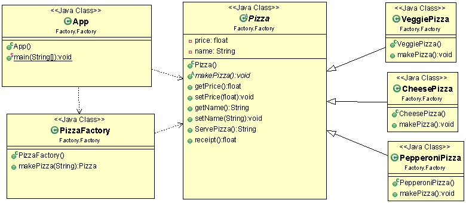

# Factory Design Pattern

Definition from Book: “Factory method defines an interface for creating an object, but let subclasses decide which class to instantiate. Factory Method lets a class defer instantiation to subclasses.”\.

## Participants in Pattern

### Product

- defines the interface of objects the factory method creates.

### ConcreteProduct

- implements the Product interface.

### Creator

- It declares the factory method, which returns an object of type Product\.
Creator may also define a default implementation of the factory method that returns a default ConcreteProduct object\.
- It may call the factory method to create a Product object\.

### ConcreteCreator

- overrides the factory method to return an instance of a ConcreteProduct\.

### When to use Factory Pattern

Use the Factory pattern when:

- a class can't anticipate the class of objects it must create\.
- a class wants its subclasses to specify the objects it creates\.
- classes delegate responsibility to one of several helper subclasses, and you want to localize the knowledge of which helper subclass is the delegate\.

UML Class Diagram:

 

