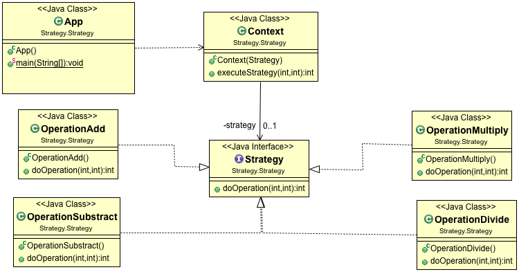

# Strategy Design Pattern

Sometimes in your application you have similar objects with different algorithms/behaviors and you want to have the flexibility to select the behavior dynamically at run time\.

## Participants in Pattern

### Strategy

It declares an __interface__ common to all undelaying supported algorithms

### Concrete Strategy

Implements the algorithm using the __Strategy interface__

### Context \(Composition\)

It is configured with a __ConcreteStrategy__ object and maintains a reference to a Strategy object\.

### When to use Strategy Pattern

Use the Strategy pattern when:

- You have many classes that differ only in their behavior\.
- You have different variants of an algorithm or functionality\.
- You want to avoid exposing complex, algorithm\-specific data structures to clients\. An Algorithm uses data that you want to hide it from client\.
- You have a class that defines many behaviors and these have multiple conditional statements in its operations\.

UML Class Diagram:

 

